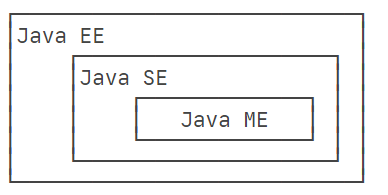

# 1. java语言类型 以及1版本关系

+ **Java介于编译型语言和解释型语言之间**。编译型语言如C、C++，代码是直接编译成机器码执行，但是不同的平台（x86、ARM等）CPU的指令集不同，因此，需要编译出每一种平台的对应机器码。解释型语言如Python、Ruby没有这个问题，可以由解释器直接加载源码然后运行，代价是运行效率太低。而Java是**将代码编译成一种“字节码”，它类似于抽象的CPU指令，然后，针对不同平台编写虚拟机，不同平台的虚拟机负责加载字节码并执行，**这样就实现了“一次编写，到处运行”的效果。当然，这是针对Java开发者而言。对于虚拟机，需要为每个平台分别开发。为了保证不同平台、不同公司开发的虚拟机都能正确执行Java字节码，SUN公司制定了一系列的Java虚拟机规范。从实践的角度看，JVM的兼容性做得非常好，低版本的Java字节码完全可以正常运行在高版本的JVM上。

+ 随着Java的发展，SUN给Java又分出了三个不同版本：

  - Java SE：Standard Edition

  - Java EE：Enterprise Edition

  - Java ME：Micro Edition



+ 简单来说，Java SE就是标准版，包含标准的JVM和标准库，而Java EE是企业版，它只是在Java SE的基础上加上了大量的API和库，以便方便开发Web应用、数据库、消息服务等，Java EE的应用使用的虚拟机和Java SE完全相同。

+ Java ME就和Java SE不同，它是一个针对嵌入式设备的“瘦身版”，Java SE的标准库无法在Java ME上使用，Java ME的虚拟机也是“瘦身版”。

+ 毫无疑问，Java SE是整个Java平台的核心，而Java EE是进一步学习Web应用所必须的。我们熟悉的Spring等框架都是Java EE开源生态系统的一部分。不幸的是，Java ME从来没有真正流行起来，反而是Android开发成为了移动平台的标准之一，因此，没有特殊需求，不建议学习Java ME。

  - JDK：Java Development Kit

  - JRE：Java Runtime Environment
  - JSR规范：Java Specification Request
  - JCP组织：Java Community Process

+ 简单地说，JRE就是运行Java字节码的虚拟机。但是，如果只有Java源码，要编译成Java字节码，就需要JDK，因为JDK除了包含JRE，还提供了编译器、调试器等开发工具。

+ 二者关系如下：

```ascii
  ┌─    ┌──────────────────────────────────┐
  │     │     Compiler, debugger, etc.     │
  │     └──────────────────────────────────┘
 JDK ┌─ ┌──────────────────────────────────┐
  │  │  │                                  │
  │ JRE │      JVM + Runtime Library       │
  │  │  │                                  │
  └─ └─ └──────────────────────────────────┘
        ┌───────┐┌───────┐┌───────┐┌───────┐
        │Windows││ Linux ││ macOS ││others │
        └───────┘└───────┘└───────┘└───────┘
```

# 2. java 8下载

+ 配置环境变量,方便全局调用

# 3. bin目录

- java：这个可执行程序其实就是JVM，运行Java程序，就是启动JVM，然后让JVM执行指定的编译后的代码；
- javac：这是Java的编译器，它用于把Java源码文件（以`.java`后缀结尾）编译为Java字节码文件（以`.class`后缀结尾）；
- jar：用于把一组`.class`文件打包成一个`.jar`文件，便于发布；
- javadoc：用于从Java源码中自动提取注释并生成文档；
- jdb：Java调试器，用于开发阶段的运行调试。

# 4.  Hello World

+ **文件名必须和类名相同**

  `Hello.java`

  ```java
  public class Hello {
      public static void main(String[] args){
          System.out.println("Hello world");
      }
  }
  ```

+ 在 Hello这个class 中, 定义了一个名为`main`的方法

+ Java规定，**某个类定义的`public static void main(String[] args)`是Java程序的固定入口方法**，因此，Java程序总是从`main`方法开始执行。

+ 注意到Java源码的缩进不是必须的，但是用缩进后，格式好看，很容易看出代码块的开始和结束，缩进一般是4个空格或者一个tab。

+ 最后，当我们把代码保存为文件时，文件名必须是`Hello.java`，而且文件名也要注意大小写，因为要和我们定义的类名`Hello`完全保持一致。

## 4.1 java文件的运行过程

Java源码本质上是一个文本文件，我们需要先用`javac`把`Hello.java`编译成字节码文件`Hello.class`，然后，用`java`命令执行这个字节码文件：

```ascii
┌──────────────────┐
│    Hello.java    │◀── source code
└──────────────────┘
          │ compile
          ▼
┌──────────────────┐
│   Hello.class    │◀── byte code
└──────────────────┘
          │ execute
          ▼
┌──────────────────┐
│    Run on JVM    │
└──────────────────┘
```

因此，可执行文件`javac`是**编译器**，而可执行文件`java`就是**虚拟机**。

第一步，在保存`Hello.java`的目录下执行命令`javac Hello.java`：

```
$ javac Hello.java
```

如果源代码无误，上述命令不会有任何输出，而当前目录下会产生一个`Hello.class`文件：

```
$ ls
Hello.class	Hello.java
```

第二步，执行`Hello.class`，使用命令`java Hello`：

```
$ java Hello
Hello, world!
```

注意：给虚拟机传递的参数`Hello`是我们定义的类名，虚拟机自动查找对应的class文件并执行。

有一些童鞋可能知道，直接运行`java Hello.java`也是可以的：

```
$ java Hello.java 
Hello, world!
```

这是Java 11新增的一个功能，它可以直接运行一个单文件源码！

需要注意的是，在实际项目中，单个不依赖第三方库的Java源码是非常罕见的，所以，绝大多数情况下，我们无法直接运行一个Java源码文件，原因是它需要依赖其他的库。

+ 总结

  + 一个Java源码只能定义一个`public`类型的class，并且class名称和文件名要完全一致；

  + 使用`javac`可以将`.java`源码编译成`.class`字节码；

  + 使用`java`可以运行一个已编译的Java程序，参数是类名。

# 5. Java 程序基本结构 太简单跳过

类名要求：

- 类名必须以英文字母开头，后接字母，数字和下划线的组合
- 习惯以大写字母开头

要注意遵守命名习惯，好的类命名：

- Hello
- NoteBook
- VRPlayer

不好的类命名：

- hello
- Good123
- Note_Book
- _World

注意到`public`是访问修饰符，表示该`class`是公开的。

**不写`public`，也能正确编译，但是这个类将无法从命令行执行。**


# 6.  变量和数据类型

## 6.1 基本数据类型

+ 基本数据类型是CPU可以直接进行运算的类型。Java定义了以下几种基本数据类型：

  - 整数类型：byte，short，int，long

  - 浮点数类型：float，double

  - 字符类型：char

  - 布尔类型：boolean

### 6.1.1 整型

+ 不同的数据类型占用的字节数不一样。我们看一下Java基本数据类型占用的字节数(Byte)：

  ```ascii
         ┌───┐
    byte │   │
         └───┘
         ┌───┬───┐
   short │   │   │
         └───┴───┘
         ┌───┬───┬───┬───┐
     int │   │   │   │   │
         └───┴───┴───┴───┘
         ┌───┬───┬───┬───┬───┬───┬───┬───┐
    long │   │   │   │   │   │   │   │   │
         └───┴───┴───┴───┴───┴───┴───┴───┘
         ┌───┬───┬───┬───┐
   float │   │   │   │   │
         └───┴───┴───┴───┘
         ┌───┬───┬───┬───┬───┬───┬───┬───┐
  double │   │   │   │   │   │   │   │   │
         └───┴───┴───┴───┴───┴───┴───┴───┘
         ┌───┬───┐
    char │   │   │
         └───┴───┘
  ```

  `byte`恰好就是一个字节，而`long`和`double`需要8个字节。

  - byte：``-2^7~2^7-1`               -128 ~ 127          

  - short: `-2^15~2^15-1`             -32768 ~ 32767 

  - int: `-2^31~2^31-1`                  -2147483648 ~ 2147483647

  - long:`-2^63~2^63-1`                -9223372036854775808 ~ 9223372036854775807

+ 注意:

  1. long类型 结尾需要 l(L)

  2. float结尾 需要f(F)

  3. 浮点数运算由于二进制小数原因,并不准确

     1. 整数运算在除数为`0`时会报错，而浮点数运算在除数为`0`时，不会报错，但会返回几个特殊值：
  
        1. `NaN`表示Not a Number
        2. `Infinity`表示无穷大
        3. `-Infinity`表示负无穷大
  
     2. 由于浮点数存在运算误差，所以比较两个浮点数是否相等常常会出现错误的结果。正确的比较方法是判断两个浮点数之差的绝对值是否小于一个很小的数：
  
        ```java
        // 比较x和y是否相等，先计算其差的绝对值:
        double r = Math.abs(x - y);
        // 再判断绝对值是否足够小:
        if (r < 0.00001) {
            // 可以认为相等
        } else {
            // 不相等
        }
        ```
  
  
  `DataType.java`
  
  ```java
  public class DataType {
      public static void main(String[] args){
         /**
           * 溢出处理
           * */
          int x = 2147483640;
          int y = 15;
          int sum = x + y;
          System.out.println(sum); // -2147483641
          int j=0xff22;//65314 16进制表示
          int b=0b010101;// 21 2进制表示
          long l=12131233313L;// 12131233313 long类型结尾要加l(L,不区分大小写)
          float f=2.3234242f;// 2.323424 类似于c/c++ float类型结尾需要加上f来和double做区分
  
          System.out.print(j+"\n");
          System.out.print(b+"\n");
          System.out.print(l+"\n");
          System.out.print(f+"\n");
      }
  }
  ```

### 6.1.2 Boolean类型(4 byte)

+ Java语言对布尔类型的存储并没有做规定，因为理论上存储布尔类型只需要1 bit，但是通常JVM内部会把`boolean`表示为4字节整数。

`DataType.java`

```java
public class DataType {
    public static void main(String[] args){
        boolean b1=true;
        boolean b2=false;
        System.out.print(b1+"\n");
        System.out.print(b2+"\n");
    }
}
```

### 6.1.3  char 类型

+ 注意`char`类型使用单引号`'`，且仅有一个字符，要和双引号`"`的字符串类型区分开。

+ 字符类型`char`表示一个字符。Java的`char`类型除了可表示标准的ASCII外，还可以表示<mark>一个Unicode字符</mark>：

`DataType.java`

```java
public class DataType {
    /* constructor func */
    DataType(){
        test();
    }
    public static void main(String[] args){
        /**
         * 溢出处理
         * */
        int x = 2147483640;
        int y = 15;
        int sum = x + y;
        System.out.println(sum); // -2147483641

        double f1=1.0/10;
        double f2=1-9.0/10;
        System.out.println("f1: "+f1);
        System.out.println("f2: "+f2);// 0.09999999999999998
        System.out.println("f1==f2 "+(f1==f2));// false
        int j=0xff22;//65314 16进制表示
        int b=0b010101;// 21 2进制表示
        long l=12131233313L;// 12131233313 long类型结尾要加l(L,不区分大小写)
        float f=2.3234242f;// 2.323424 类似于c/c++ float类型结尾需要加上f来和double做区分
        boolean b1=true;
        boolean b2=false;

        char c1='c';
        char c2='哈';

        final double PI=3.14;// 常量在定义时进行初始化后就不可再次赋值，再次赋值会导致编译错误。
        // PI=55;// error

        System.out.print(j+"\n");
        System.out.print(b+"\n");
        System.out.print(l+"\n");
        System.out.print(f+"\n");
        System.out.print(b1+"\n");
        System.out.print(b2+"\n");
        System.out.print(c1+"\n");
        System.out.print(c2+"\n");
        System.out.print(PI+"\n");// 3.14
    };

    public void test(){
        System.out.print(this+"this");
    };
}
```

## 6.2 引用类型

引用类型最常用的就是`String`字符串：

```
String s = "hello";
```

引用类型的变量类似于C语言的指针，它内部存储一个“地址”，指向某个对象在内存的位置

## 6.3 常量定义(final 修饰符)

```java
public class DataType {
    public static void main(String[] args){
      
        final double PI=3.14;// 常量在定义时进行初始化后就不可再次赋值，再次赋值会导致编译错误。
        // PI=55;// error
        System.out.print(PI+"\n");// 3.14
    }
}

```

## 6.4 var关键字(类似于自动类型推导 auto?)

有些时候，类型的名字太长，写起来比较麻烦。例如：

```
StringBuilder sb = new StringBuilder();
```

这个时候，如果想省略变量类型，可以使用`var`关键字：

```
var sb = new StringBuilder();
```

编译器会根据赋值语句自动推断出变量`sb`的类型是`StringBuilder`。对编译器来说，语句：

```
var sb = new StringBuilder();
```

实际上会自动变成：

```
StringBuilder sb = new StringBuilder();
```

因此，使用`var`定义变量，仅仅是少写了变量类型而已。

## 6.5 String and char

### 字符类型

字符类型`char`是基本数据类型，它是`character`的缩写。一个`char`保存一个Unicode字符：

```
char c1 = 'A';
char c2 = '中';
```

因为Java在内存中总是使用Unicode表示字符，所以，一个英文字符和一个中文字符都用一个`char`类型表示，它们都占用两个字节。要显示一个字符的Unicode编码，只需将`char`类型直接赋值给`int`类型即可：

```
int n1 = 'A'; // 字母“A”的Unicodde编码是65
int n2 = '中'; // 汉字“中”的Unicode编码是20013
```

还可以直接用转义字符`\u`+Unicode编码来表示一个字符：

```
// 注意是十六进制:
char c3 = '\u0041'; // 'A'，因为十六进制0041 = 十进制65
char c4 = '\u4e2d'; // '中'，因为十六进制4e2d = 十进制20013
```

### 字符串类型

+ **和js不同, 在java中String是引用类型**,其余特性和js基本相同

+ 和`char`类型不同，字符串类型`String`是引用类型，我们用双引号`"..."`表示字符串。一个字符串可以存储0个到任意个字符：

```java
public class StringAndChar {
    public static void main(String[] args){
        String s="";
        String s1="A";
        // String字符串 在Java中是引用类型
        String s2="Hello world";
        String s3=s2;
        s2="ybb"; // 赋值改变的只是栈内存中地址指向, 堆内存中的字符串内容并没有改变
        System.out.println("原来s2指向的堆内存地址的内容 : "+s3);
        System.out.println("现在的s2 : "+s2);

        // null 和 "" (空字符串不相等)
        System.out.println(null=="");// false

         // 字符串拼接
        int a=123;
        int b=456;
        String s5=a+""+b;// 123456
        System.out.println(s5);
    }
}
```


## 6.6 数组类型(引用类型)

+ 定义一个数组类型的变量，使用数组类型`类型[]`，例如，`int[]`。和单个基本类型变量不同，数组变量初始化必须使用`new int[5]`表示创建一个可容纳5个`int`元素的数组。

Java的数组有几个特点：

- **数组所有元素初始化为默认值**，整型都是`0`，浮点型是`0.0`，布尔型是`false`；
- 数组一旦创建后，大小就不可改变。

要访问数组中的某一个元素，需要使用索引。数组索引从`0`开始，例如，5个元素的数组，索引范围是`0`~`4`。

可以修改数组中的某一个元素，使用赋值语句，例如，`ns[1] = 79;`。

可以用`数组变量.length`获取数组大小：


+ 注意点:
  1. 数组是引用类型，在使用索引访问数组元素时，如果索引超出范围，运行时将报错
  2. 注意数组是引用类型，并且数组大小不可变。
  3. 可以在定义数组时直接指定初始化的元素，这样就不必写出数组大小，而是由编译器自动推算数组大小。

```java
public class ArrayType {
    public static void main(String[] args){
        int[] ns=new int[5];
        System.out.println(ns.length);// 5
       // System.out.println(ns[5]);// 访问超出范围限制,报错
        int[] arr={1,2,3,4,5};
        String[] names={"ABC","DEF","XYA"};
        String s1=names[1];
        System.out.println(s1);
        names[1]="YBB";
        System.out.println(s1);
    }
}
```


# 7. 输入和输出

`System.out.println`中的`println`是`print line`的缩写,打印在一行的意思, 换行可以直接使用`print`方法


## 7.1 格式化输出

+ Java还提供了格式化输出的功能。为什么要格式化输出？因为计算机表示的数据不一定适合人来阅读

+ 如果要把数据显示成我们期望的格式，就需要使用格式化输出的功能。格式化输出使用`System.out.printf()`，通过使用占位符`%?`，`printf()`可以把后面的参数格式化成指定格式

+ Java的格式化功能提供了多种占位符，可以把各种数据类型“格式化”成指定的字符串：

  | 占位符 | 说明                             |
  | :----- | :------------------------------- |
  | %d     | 格式化输出整数                   |
  | %x     | 格式化输出十六进制整数           |
  | %f     | 格式化输出浮点数                 |
  | %e     | 格式化输出科学计数法表示的浮点数 |
  | %s     | 格式化字符串                     |

  注意，由于%表示占位符，因此，连续两个%%表示一个%字符本身。

​		详细的格式化参数请参考JDK文档[java.util.Formatter](https://docs.oracle.com/en/java/javase/11/docs/api/java.base/java/util/Formatter.html#syntax)

## 7.2 输入

```java
import java.util.Scanner;
public class FormatterIO {
    public static void main(String[] args){
        int a=123456;
        float b=2.34343f;
        System.out.printf("%s,%s",a,b);
        System.out.print(a);
        System.out.printf("%s,%.2f\n",a,b);

        // 输入
        Scanner scanner=new Scanner(System.in);
        System.out.print("Input your name");
        String name=scanner.nextLine();// 读取一行输入并获取字符串
        System.out.print("Input your age");
        int age=scanner.nextInt();//    读取一行输入并获取整数
        System.out.printf("Hi, %s,you are %d\n",name,age);

        System.out.print("请输入上次考试的成绩");
        int beforeScore= scanner.nextInt();
        System.out.print("请输入本次考试的成绩");
        int nowScore=scanner.nextInt();
        System.out.printf("你的成绩相对于上次成绩提升得到百分比为: %.2f%%",(float)(nowScore-beforeScore)/nowScore*100);

    }
}
```

首先，我们通过`import`语句导入`java.util.Scanner`，`import`是导入某个类的语句，必须放到Java源代码的开头，后面我们在Java的`package`中会详细讲解如何使用`import`。

然后，创建`Scanner`对象并传入`System.in`。`System.out`代表标准输出流，而`System.in`代表标准输入流。直接使用`System.in`读取用户输入虽然是可以的，但需要更复杂的代码，而通过`Scanner`就可以简化后续的代码。

有了`Scanner`对象后，要读取用户输入的字符串，使用`scanner.nextLine()`，要读取用户输入的整数，使用`scanner.nextInt()`。`Scanner`会自动转换数据类型，因此不必手动转换。


## 8 数组操作方法

## 8.1 遍历

+ for循环 
+ foreach(和js不同,没有索引参数)
+ Arrays.toString(快速打印数组)

```java
// 1. 数组遍历 for 循环
        int[] arr2 = {1, 2, 3, 4, 5, 6};
        for (int i = 0; i < arr2.length; i++) {
            System.out.println(arr2[i]);
        }
        // 2. forEach 遍历
        for (int item : arr2
        ) {
            System.out.print(item);
        }
        // 3.导入Java标准库 Arrays.toString 快速打印数组
        System.out.print(Arrays.toString(arr2));// 打印结果为[1,2,3,4,5,6]

        // 4. 按照倒序遍历下面的数组
        int arr3[] = { 1, 4, 9, 16, 25 };// java 可以使用c/c++ 语言风格的数组
        for (int i = 0; i < arr3.length; i++) {
            System.out.print(arr3[arr3.length-i-1]);// 25 16 9 4 1
        }
```


## 8.2 数组排序

1. for循环手动排序 选择排序 冒泡排序

2. java标准库中的Arrays.sort()方法(默认为升序排序)

   ```java
   		int arr4[] = { 28, 12, 89, 73, 65, 18, 96, 50, 8, 36 };
           Arrays.sort(arr4);
           System.out.print('\n');
           System.out.print(Arrays.toString(arr4));// [8, 12, 18, 28, 36, 50, 65, 73, 89, 96]
   ```

## 8.3 多维数组 没有指针太简单,跳过

## 8.4 命令行参数

Java程序的入口是`main`方法，而`main`方法**可以接受一个命令行参数，它是一个`String[]`数组**。

这个命令行参数由JVM接收用户输入并传给`main`方法：

```java
public class Main {
    public static void main(String[] args) {
        for (String arg : args) {
            System.out.println(arg);
        }
    }
}
```

+ 我们可以利用接收到的命令行参数，**根据不同的参数执行不同的代码**。例如，实现一个`-version`参数，打印程序版本号：

```java
public class Main {
    public static void main(String[] args) {
        for (String arg : args) {
            if ("-version".equals(arg)) {
                System.out.println("v 1.0");
                break;
            }
        }
    }
}
```

上面这个程序必须在命令行执行，我们先编译它：

```
$ javac Main.java
```

然后，执行的时候，给它传递一个`-version`参数：

```
$ java Main -version
v 1.0
```

这样，程序就可以根据传入的命令行参数，作出不同的响应。
